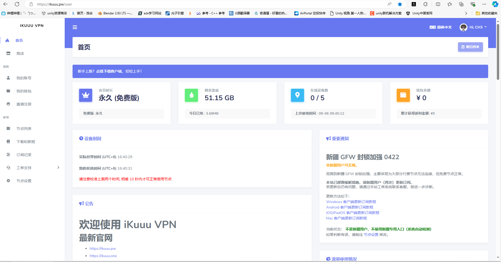
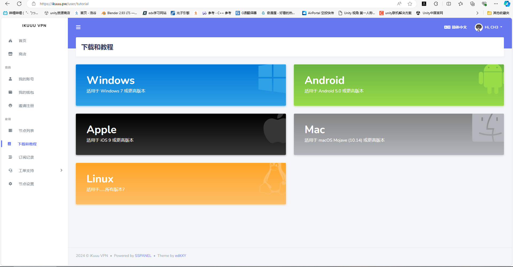
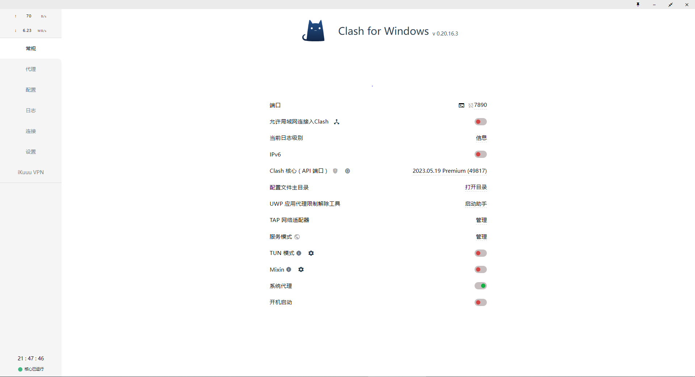
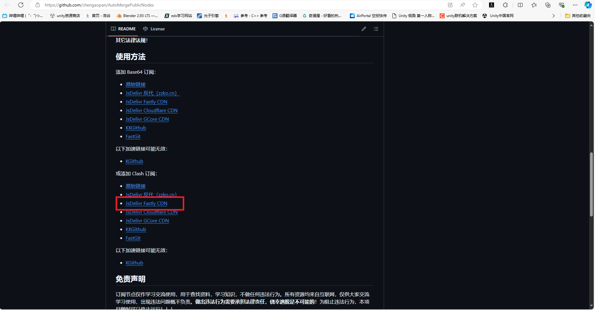
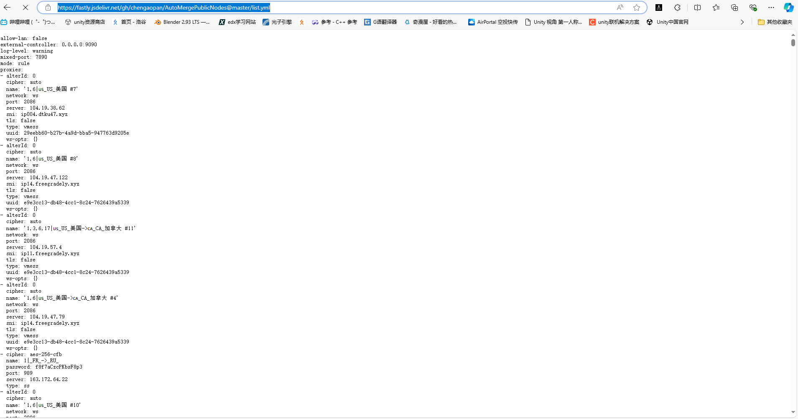
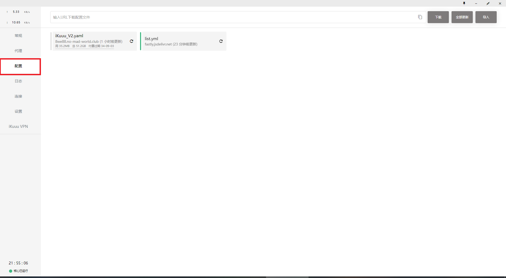

# 最新最好用免费vpn(PC教程)

## 操作原视频
[亲测！2024最新免费VPN方案，一次解决全部痛点！无限流量+解除封禁+全局代理+自带分流！
](https://www.youtube.com/watch?v=MmZH5xkZoAU&t=265s)

<video src="1.mp4"></video>

## 操作方案

1.打开[第一个网站](https://ikuuu.pw/)

2.注册后登录

登陆后长这样：

3.然后点击 **下载和教程**

4.选择自己的系统，按照提示操作(后面以Windows系统为例，其它系统也一样)

若是PC端,则会下载Clash，打开后长这样

5.打开[第二个链接](https://github.com/chengaopan/AutoMergePublicNodes)

翻到这里:

6.点击红框里的按钮

点击后长这样：

7.复制顶部链接(即蓝色框选的链接)

8.打开Clash，选中配置

即红色框里的选项：

9.将复制的链接粘贴到上方输入框

10.点击下载

11.点击list.yml

12.点击代理，选择自动选择或延迟最低

## 说明：

当网络卡顿时，在代理中切换自动选择或延迟最低（即当你选择的是自动选择时，切换至延迟最低，反之同理）。如若都不能用，则切换至手动选择。